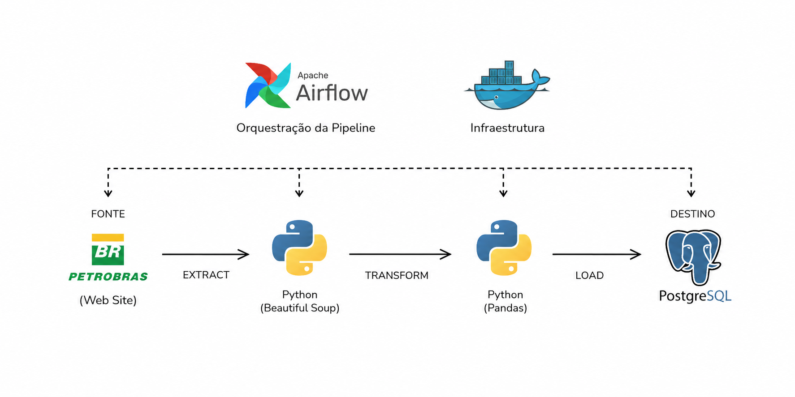

# ETL: Composição de Preços da Petrobras (Gasolina, Diesel e GLP)

<div align="center">
  
[](https://python.org)
[](https://airflow.apache.org/)
[](https://www.docker.com/)
[](https://www.postgresql.org/)

</div>

## 📌 Sobre o Projeto

Este projeto consiste em um pipeline de dados (ETL) automatizado, desenhado para realizar **Web Scraping** no portal oficial de preços da [Petrobras](https://precos.petrobras.com.br/).

O pipeline extrai a **composição detalhada do preço médio nacional** para Gasolina, Diesel e GLP (Gás de Cozinha). Os dados extraídos incluem a granularidade de:
* **Parcela Petrobras** (Preço na refinaria)
* **Custo do Etanol Anidro / Biodiesel** (Mistura obrigatória)
* **Impostos Federais** (CIDE, PIS/PASEP e COFINS)
* **Imposto Estadual** (ICMS)
* **Distribuição e Revenda** (Margens operacionais)

A infraestrutura foi construída com foco em escalabilidade e boas práticas de Engenharia de Dados, sendo totalmente conteinerizada com **Docker** e orquestrada utilizando o **Apache Airflow**.

## 🏗️ Arquitetura e Fluxo de Dados

<div align="center">
  
</div>

<br>

O pipeline é executado diariamente (às 08:00) garantindo a captura histórica das flutuações de mercado. O fluxo é dividido em três etapas principais (utilizando TaskFlow API):

1. **Extract (`extract`)**: Um script em Python realiza o web scraping na fonte de dados (`precos.petrobras.com.br`), navegando pelas categorias (Gasolina, Diesel, GLP) e coletando as métricas da média nacional da composição de preços.
2. **Transform (`transform`)**: Os dados brutos são limpos e tipados usando **Pandas**. Por se tratarem de dados monetários e percentuais, há um tratamento rigoroso de tipos. Para garantir eficiência e performance na transição de dados entre as tasks no Airflow, o *dataframe* processado é salvo temporariamente no formato colunar **Parquet**.
3. **Load (`load`)**: O arquivo Parquet é lido e os dados estruturados são ingeridos de forma otimizada em uma tabela analítica (`precos_combustiveis`) no **PostgreSQL**, prontos para consumo por ferramentas de BI.

## 🛠️ Tecnologias Utilizadas

* **Linguagem:** Python 3.14 (Pandas, Beautiful Soup)
* **Orquestração de Dados:** Apache Airflow 3.1.7
* **Banco de Dados / Data Warehouse:** PostgreSQL 16
* **Infraestrutura:** Docker & Docker Compose

## 📂 Estrutura do Repositório

```text
├── config/                 # Arquivos de configuração adicionais (ex: airflow.cfg)
├── dags/                   # Diretório de DAGs lidas pelo Airflow
│   └── petrobras_dag.py    # Pipeline principal de orquestração
├── data/                   # Armazenamento temporário/local (arquivos Parquet gerados)
├── logs/                   # Logs de execução das tasks do Airflow
├── notebook/               # Notebooks para prototipação e análise exploratória
├── plugins/                # Plugins e operadores customizados do Airflow
├── src/                    # Lógica principal de extração e transformação (Python)
│   ├── extract.py          # Módulo de Web Scraping
│   ├── transform.py        # Módulo de limpeza e estruturação (Pandas)
│   └── load_data.py        # Módulo de conexão e ingestão no PostgreSQL
├── .env.example            # Template seguro de variáveis de ambiente
├── .gitignore              # Regras de exclusão de arquivos no controle de versão
├── docker-compose.yaml     # Configuração da infraestrutura (Airflow, Postgres, Redis)
├── init-db.sql             # Script DDL para inicialização do banco de dados
├── main.py                 # Arquivo de execução local (testes fora do Airflow)
├── pyproject.toml          # Arquivo de configuração de dependências modernas (uv)
├── uv.lock                 # Lockfile do gerenciador de pacotes
└── README.md               # Documentação do projeto
```

## 🐳 Detalhes da Infraestrutura (Docker)
O projeto foi empacotado utilizando docker-compose, rodando múltiplos serviços interconectados para simular um ambiente de produção real. A infraestrutura conta com:
*  **PostgreSQL (16)**: Atua com dupla responsabilidade neste projeto. Ele serve como o banco de metadados padrão do Airflow e também hospeda o banco de dados analítico (combustiveis) onde os dados finais são carregados.
*  **Airflow Services**: A arquitetura do orquestrador foi dividida em seus componentes essenciais (airflow-apiserver, airflow-scheduler, airflow-dag-processor e airflow-worker), configurados com o CeleryExecutor para permitir processamento paralelo e escalabilidade.
*  **Volumes Persistentes**: Os diretórios /dags, /logs, /plugins e /data estão mapeados em volumes, o que permite editar o código localmente e refletir automaticamente no container sem precisar de rebuild.

## 🌬️ Orquestração e DAGs (Airflow)
A DAG (petrobras_dag) foi desenvolvida seguindo os paradigmas modernos do Airflow, utilizando a TaskFlow API (decorators @dag e @task).
Características da DAG:
*  **Agendamento**: schedule='0 8 * * *' (Rodagem diária às 8 da manhã).
*  **Idempotência e Confiabilidade**: Configurada com catchup=False para evitar sobrecarga de execuções retroativas não intencionais, além de possuir uma política automática de retentativas (retries: 2, retry_delay: 5 min) em caso de falhas de rede no Web Scraping.
*  **Gestão de XCom**: Embora a TaskFlow API passe metadados implicitamente via XCom, o pipeline evita o sobrecarregamento do banco de dados do Airflow. Os dados pesados são gravados em disco na etapa Transform como arquivo .parquet, e a etapa Load apenas lê este arquivo, respeitando as melhores práticas de Engenharia de Dados.

## 🚀 Como Executar o Projeto Localmente

### Pré-requisitos
Certifique-se de ter instalado em sua máquina:
* [Docker](https://docs.docker.com/get-docker/)
* [Docker Compose](https://docs.docker.com/compose/install/)

### Passo a Passo

**1. Clone o repositório**
```bash
git clone https://github.com/SEU_USUARIO/etl_petrobras
cd etl_petrobras
```

**2. Configure as Variáveis de Ambiente**
O projeto utiliza um arquivo `.env` para gerenciar as credenciais locais do banco de dados e do orquestrador. 
Para rodar o projeto, crie uma cópia do arquivo de exemplo:

```bash
cp .env.example .env

```
**3. Inicialize o Banco de Dados do Airflow**
Antes de subir os serviços pela primeira vez, inicialize as tabelas de metadados do Airflow:
```bash
docker-compose up airflow-init
```

**4. Suba a Infraestrutura Completa**
Inicie o Airflow, PostgreSQL e os demais serviços em segundo plano:
```bash
docker-compose up -d
```

**5. Acesse as Interfaces**
* **Apache Airflow UI:** Acesse `http://localhost:8080` (Login: `airflow` / Senha: `airflow`). Lá você poderá ativar a DAG `petrobras_dag` e monitorar sua execução.
* **Banco de Dados (PostgreSQL):** O banco de dados para consulta dos dados ingeridos está exposto na porta `5433` da sua máquina host.
  * **Host:** `localhost`
  * **Porta:** `5433`
  * **Database:** `combustiveis`
  * **User:** `airflow`
  * **Password:** `airflow`

## 🧹 Encerrando a Aplicação
Para parar os containers e limpar a rede criada pelo Docker, execute:
```bash
docker-compose down
```
*(Se desejar apagar também os volumes persistentes e limpar o banco de dados do zero, adicione a flag `-v`: `docker-compose down -v`)*
